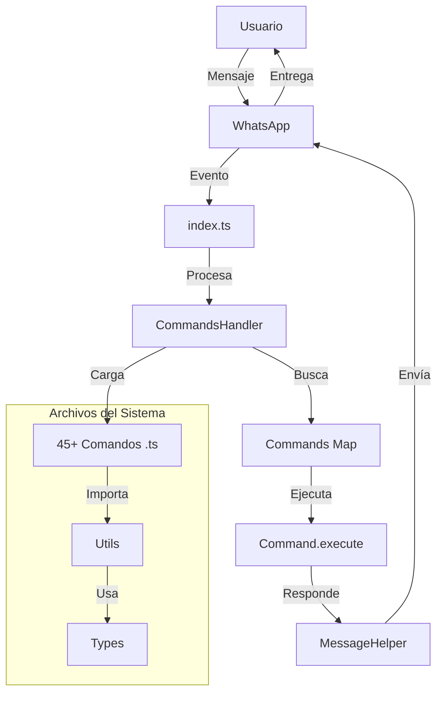
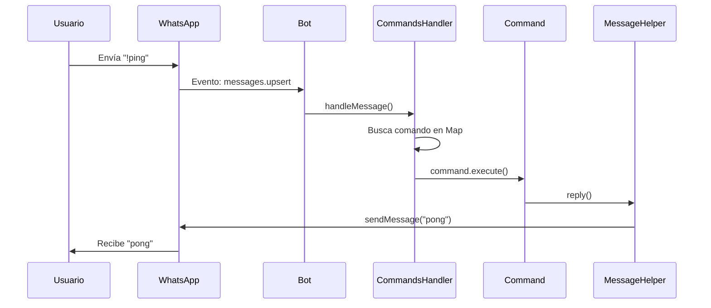
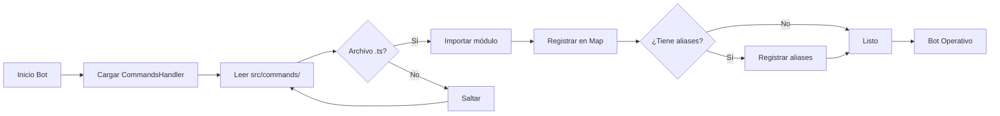
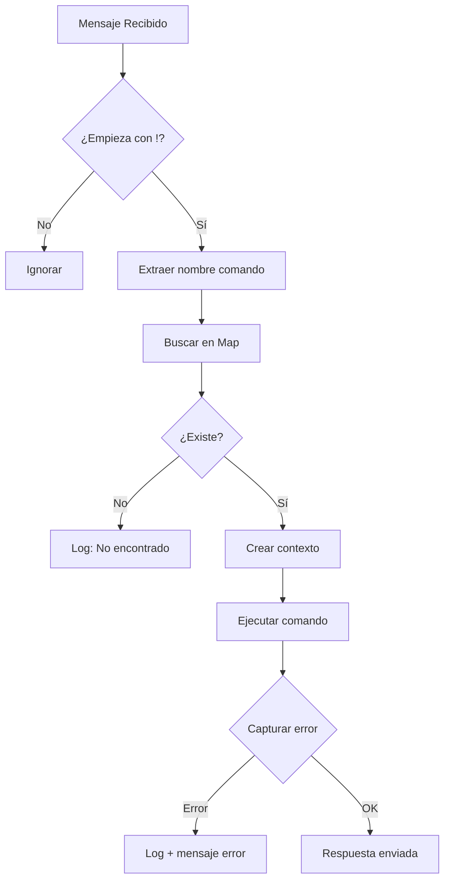
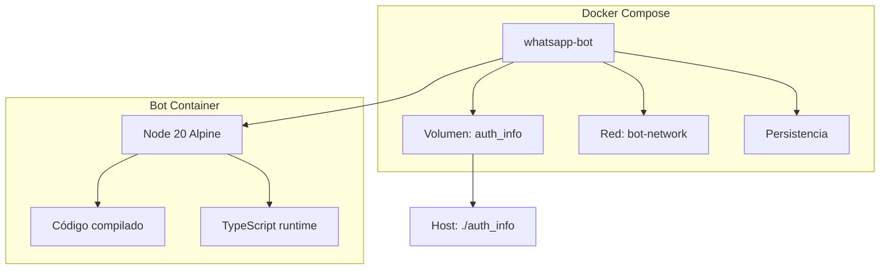
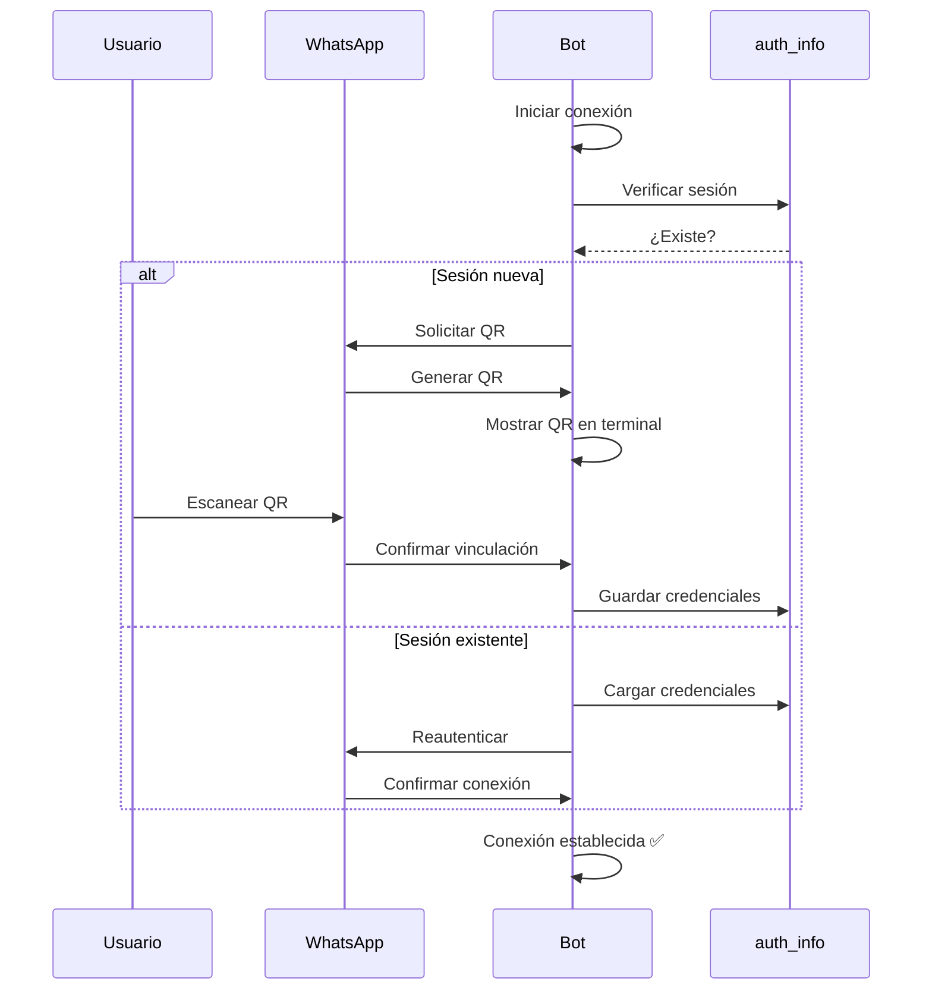
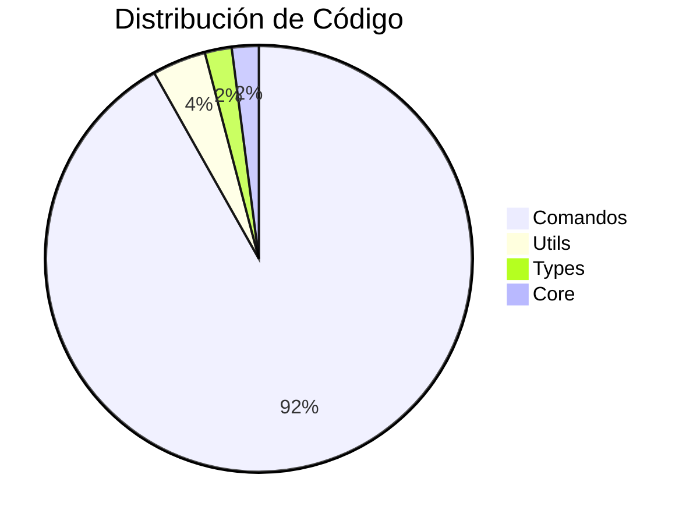
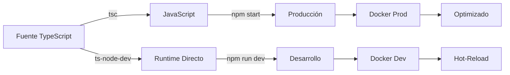
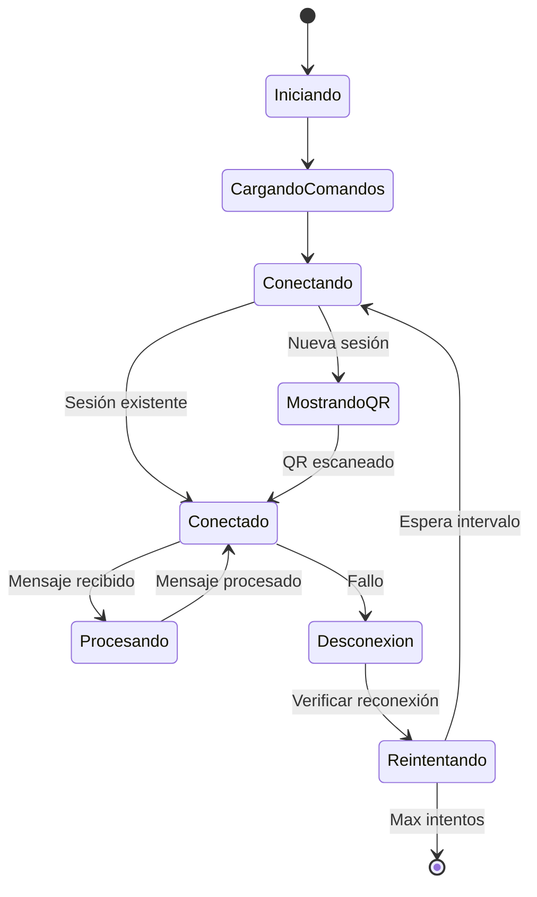

# 🤖 Bot de WhatsApp con TypeScript y Baileys

Bot de WhatsApp con arquitectura modular en TypeScript y Baileys, 45+ comandos, Docker y hot-reload.

## 🌟 Características Principales

### 💪 Funcionalidades Core
- ✅ **Conexión estable** a WhatsApp Web
- ✅ **Reconexión automática** ante desconexiones
- ✅ **Sistema de comandos modular** con 45+ comandos
- ✅ **Arquitectura escalable** y mantenible
- ✅ **Hot-reload** en modo desarrollo
- ✅ **QR Code** mejorado en terminal

### 🛡️ Tecnologías
- **TypeScript** - Tipado estático
- **Baileys** - Librería de WhatsApp
- **Docker** - Contenedores para despliegue
- **pino** - Logging

## 📊 Arquitectura



## 🚀 Instalación Rápida

### Con Docker (Recomendado)

```bash
# 1. Clonar repositorio
git clone https://github.com/4h1g4L0w4/UnderB0t-v3
cd Nuevo-bot

# 2. Ejecutar en producción
docker-compose up -d

# 3. Ver logs y QR
docker-compose logs -f

# 4. Escanear QR con WhatsApp
```

### Modo Desarrollo

```bash
docker-compose -f docker-compose.dev.yml up
```

Los cambios en `src/` se aplican automáticamente con hot-reload.

## 📋 Requisitos

| Requisito | Versión Mínima |
|-----------|----------------|
| Node.js | 20+ |
| Docker | 20.10+ |
| Docker Compose | 2.0+ |
| WhatsApp | Cualquiera |

## 🎯 Comandos Disponibles (45+)

### 📋 Información y Ayuda

```typescript
!help        → Lista completa de comandos
!info        → Información sobre los grupos
!underc0de   → ¿Qué es Underc0de?
!bienvenido  → Mensaje de bienvenida
!bot         → Presentación del bot
```

### 🔗 Links y Recursos

```typescript
!links       → Links útiles de la comunidad
!grupos      → Grupos de WhatsApp
!canales     → Canales informativos
!discord     → Servidor de Discord
!app         → App de Underc0de
!foro        → Foro de Underc0de
!qa          → Recursos de QA
!torrent     → Cursos en torrent
```

### 🎓 Educación y Trabajo

```typescript
!pasantias   → Información de pasantías
!pro         → Ser miembro PRO
!cowork      → Cowork virtual
!donar       → Donaciones
```

### 📢 Gestión

```typescript
!reglas      → Reglas de la comunidad
!reglascv    → Reglas compra/venta
!report      → Reportar a admins
!juntada     → Próxima juntada
!todos       → Mencionar a todos (admins)
```

### 🎉 Divertidos

```typescript
!cerveza     → Te sirve una birra
!fernet      → Te da un fernet
!hola        → Saludo
!saludo      → Saludo especial
!ndeah       → Expresión de entusiasmo
!dc          → Invitación a Discord
!cs          → Jugar CS
!futbol      → Transmisiones
!hail        → Viva Underc0de
```

### 🔧 Utilidades

```typescript
!ping        → Test de conectividad
!test        → Test de funcionamiento
!status      → Solicitar status daily
!remeras     → Remeras de Underc0de
!boedo       → Info del barrio
!offtopic    → Ir al offtopic
```

Para ver todos los comandos, envía `!help` al bot.

## 🏗️ Arquitectura del Sistema



## 📁 Estructura del Proyecto

```
Nuevo-bot/
├── 🗂️ src/
│   ├── 📜 index.ts                 # Bot principal (conexión, eventos)
│   │
│   ├── 🎮 commands/                # 45+ comandos
│   │   ├── help.ts
│   │   ├── ping.ts
│   │   ├── links.ts
│   │   ├── grupos.ts
│   │   ├── qa.ts
│   │   └── ... (42 más)
│   │
│   ├── 🛠️ utils/
│   │   ├── CommandsHandler.ts      # Maneja carga/ejecución
│   │   └── MessageHelper.ts        # Envía mensajes
│   │
│   └── 📋 types/
│       └── Command.ts              # Interfaces TypeScript
│
├── 🐳 Docker
│   ├── Dockerfile                  # Producción optimizada
│   ├── Dockerfile.dev              # Desarrollo hot-reload
│   ├── docker-compose.yml          # Stack producción
│   └── docker-compose.dev.yml      # Stack desarrollo
│
├── ⚙️ Configuración
│   ├── package.json               # Dependencias
│   ├── tsconfig.json              # TypeScript
│   ├── .dockerignore              # Ignorar en builds
│   └── .gitignore                 # Control de versiones
│
├── 📚 Documentación
│   ├── README.md                  # Este archivo
│   ├── QUICKSTART.md              # Inicio rápido
│   └── INSTRUCCIONES_DOCKER.md    # Guía Docker
│
├── 📦 Generados
│   ├── dist/                      # JS compilado
│   └── auth_info/                 # Sesión WhatsApp
│
└── 🗃️ nuevos-comandos/            # Comandos JS originales
```

## 🔧 Sistema de Comandos

### Carga Dinámica



### Flujo de Ejecución



### Ejemplo de Comando

```typescript
import { Command } from "../types/Command";
import { MessageHelper } from "../utils/MessageHelper";

const command: Command = {
  name: "!ping",
  description: "Prueba de conectividad",
  aliases: ["!p"],  // Opcional
  async execute({ client, message, args }) {
    await MessageHelper.reply(client, message.remoteJid, "🏓 pong");
  },
};

export default command;
```

## 🐳 Docker

### Arquitectura de Contenedores



### Comparación de Modos

| Característica | Producción | Desarrollo |
|----------------|------------|------------|
| Hot-reload | ❌ | ✅ |
| Compilación | Antes de start | ts-node-dev |
| Logs | Mínimos | Detallados |
| Volúmenes | Solo auth_info | Código montado |
| Imagen | Optimizada | Completa |

### Comandos Docker

```bash
# Producción
docker-compose up -d                    # Iniciar en background
docker-compose logs -f                  # Ver logs
docker-compose restart                  # Reiniciar
docker-compose down                     # Detener

# Desarrollo
docker-compose -f docker-compose.dev.yml up    # Iniciar con logs
docker-compose -f docker-compose.dev.yml down  # Detener

# Utilidades
docker-compose build --no-cache         # Reconstruir imagen
docker-compose exec whatsapp-bot sh     # Shell en contenedor
docker-compose ps                       # Ver estado
```

## 🔐 Autenticación

### Proceso de Vinculación



### Persistencia

- Carpeta `auth_info` montada como volumen en Docker
- Sesión se conserva tras reinicios
- Solo admin tiene acceso

## 📊 Estadísticas del Proyecto



| Métrica | Valor |
|---------|-------|
| Líneas de código | 2,121 |
| Comandos implementados | 45 |
| Archivos TypeScript | 48 |
| Utilidades | 2 |
| Tipos definidos | 1 |
| Comandos con alias | 5+ |

## 🛠️ Desarrollo

### Agregar un Nuevo Comando

1. Crea `src/commands/nuevo.ts`:

```typescript
import { Command } from "../types/Command";
import { MessageHelper } from "../utils/MessageHelper";

const command: Command = {
  name: "!nuevo",
  description: "Tu descripción aquí",
  aliases: ["!alias1", "!alias2"], // Opcional
  async execute({ client, message, args }) {
    const response = "Tu respuesta aquí";
    await MessageHelper.reply(client, message.remoteJid, response);
  },
};

export default command;
```

2. El comando se carga automáticamente al iniciar el bot.

### Modos de Ejecución



## 🔍 Depuración

### Logs Estructurados

El bot genera logs por actividad:

```
🚀 Iniciando bot de WhatsApp...
✅ Comando cargado: !help
✅ Comando cargado: !ping
✅ Comando cargado: !hola
📦 Total de comandos cargados: 45
📱 Escanea este código QR con WhatsApp:
[QR Code]
✅ Conexión establecida correctamente
📨 Mensaje recibido de: 1234567890@s.whatsapp.net: !ping
🔍 Buscando comando: !ping
✅ Ejecutando comando: !ping
✅ Mensaje enviado a 1234567890@s.whatsapp.net
```

### Filtrado de Errores

Errores de Baileys libsignal filtrados:
- ❌ Bad MAC errors
- ❌ MessageCounterError
- ❌ Failed to decrypt message
- ❌ Session errors

Solo se muestran logs relevantes.

## 📱 Ejemplos de Uso

### Ejemplo 1: Consulta de Ayuda

```
Usuario: !help
Bot: *Comandos disponibles:*
     
     📋 *Información y Ayuda*
     - !help - Muestra los comandos disponibles
     - !info - Información sobre los grupos
     ...
```

### Ejemplo 2: Obtener Links

```
Usuario: !links
Bot: *Links útiles de la comunidad*
     
     Como ser miembro de Underc0de: https://underc0de.org/hola
     App de Underc0de Android: https://play.google.com/...
     ...
```

### Ejemplo 3: Recursos de QA

```
Usuario: !qa
Bot: *Canales y recursos para QAs*
     
     *WhatsApp:*
     Comunidad de QA: https://chat.whatsapp.com/...
     ...
```

## ⚙️ Configuración Avanzada

### Variables de Entorno

Crea un archivo `.env`:

```env
# Configuración del Bot
BOT_NAME="UnderB0t"
BOT_VERSION="1.0.0"

# Reconexión
RECONNECT_INTERVAL=5000
MAX_RECONNECT_ATTEMPTS=5

# Permisos
ALLOWED_ADMIN="54988888888"
```

### Personalizar Reconexión

```typescript
// src/index.ts
const bot = new WhatsAppBot({
  reconnectInterval: 5000,        // 5 segundos
  maxReconnectAttempts: 5,        // 5 intentos
});

// Resultado:
// Intentos: 1 (5s), 2 (10s), 3 (15s), 4 (20s), 5 (25s)
```

## 🔄 Ciclo de Vida del Bot



## 🧪 Testing

### Comandos de Prueba

```bash
# Ejecutar tests
npm test

# Lint del código
npm run lint

# Verificar tipos
npm run type-check

# Build sin errores
npm run build
```
## 🐛 Solución de Problemas

### Problemas Comunes

<details>
<summary><b>"Bot fue cerrado de sesión"</b></summary>

```bash
# Solución
docker-compose down
rm -rf auth_info
docker-compose up -d
docker-compose logs -f
```

Elimina la carpeta `auth_info` y vuelve a escanear el QR.
</details>

<details>
<summary><b>"Errores de decriptación constantes"</b></summary>

Estos son normales en Baileys y no afectan el funcionamiento. Los logs los filtran automáticamente.
</details>

<details>
<summary><b>"Comando no funciona"</b></summary>

1. Verifica los logs: `docker-compose logs -f`
2. Revisa que el comando esté en `src/commands/`
3. Verifica la sintaxis del comando
4. Reinicia el bot: `docker-compose restart`
</details>

## 📚 Recursos

### Documentación Oficial
- [Baileys GitHub](https://github.com/WhiskeySockets/Baileys)
- [TypeScript Docs](https://www.typescriptlang.org/)
- [Docker Docs](https://docs.docker.com/)

### Guías Adicionales
- [QUICKSTART.md](QUICKSTART.md) - Inicio rápido
- [INSTRUCCIONES_DOCKER.md](INSTRUCCIONES_DOCKER.md) - Guía Docker completa
- [src/commands/README.md](src/commands/README.md) - Documentación de comandos

## 📄 Licencia

ISC License

## 👥 Créditos

- **Underc0de** - Comunidad de informáticos
- **WhiskeySockets** - Baileys library

---

<div align="center">

**Hecho con ❤️ para Underc0de**

🐙 *Larga vida a Underc0de!*

</div>
